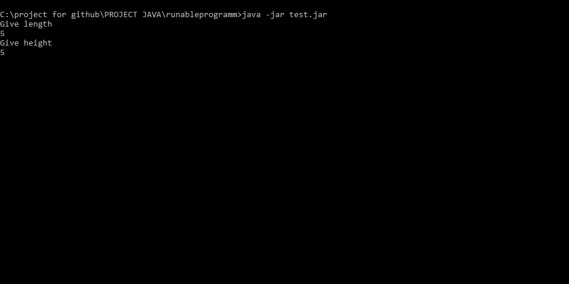
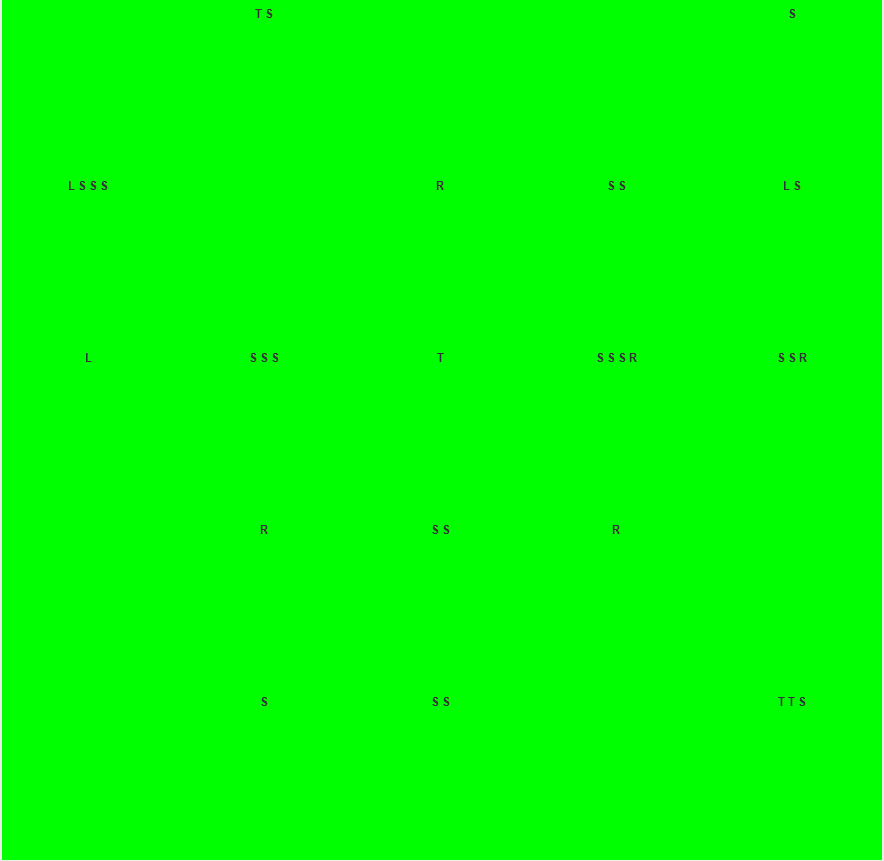
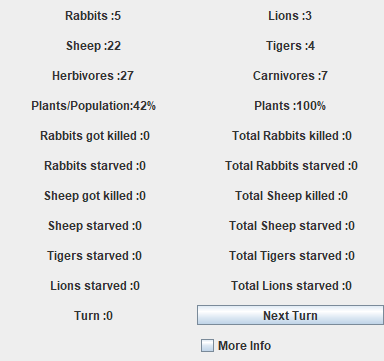

# Game of Life

First the user enters the dimension of the simulation world.

Simulation class creates a GUI which creates a world which consists of grasspanels, lions, tigers, sheep, rabbits

On each round (Button press that is on GUI class) animals move, eat, and reproduce(not every turn so that the population can decrease).

The simulation ends when no carnivores or grasspanels are left.
